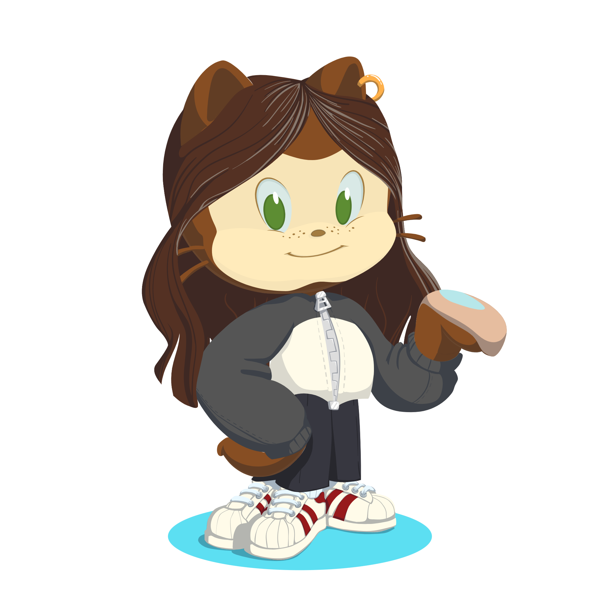

# Rescue Center 

 
Compass UOL - FrontEnd Challenge: Rescue Center Project 

## Table of Contents

- [Challenge](#challenge)
- [Figma](#figma)
- [Tools](#tools)
- [Screenshots](#screenshots)
- [Difficulties](#difficulties)
- [Author](#author)

## Challenge

This challange is from Compass UOL for the interns to complete and learn experiences.  
The main objective was to build, in 9 days, a front-end development based on the design in Figma.  
To accomplish this task, the only technologies allowed to use were HTML, CSS and JavaScript, being banned to use any framework or libraries to create the application.  
This project contains the main page, with information about the Rescue Center. The buttons *Donate Button* and *Apply to Adopt* open the *Donate Modal* and the *Adopt Modal*, respectively. The button *View Adoptables* open a new page html with the list of the availables pets for adoption. Every page has a button to go back to the main page and the Modals have a button to cancel the action, also returning to the main page.  
After the user donate, apply to adopt or subscribe an email to the newsletter, the page success appears with a message. The page success was free to create any content.

Page link: https://camilakataa.github.io/rescue-center-challenge/

## Figma

The challenge was based accordingly to the design and user interface in 🔗[Figma](https://abrupt-sword-b4e.notion.site/Desafio-Semana-4-AWS_FRONTEND_MAI24-ad336ce3d399478aab126561a92fe3a9)

## Tools

🔨 <b>HTML</b> to create the structure content of the pages, trying to do as much semantic element as possible, helping define the purpose of different parts of the content 
🔨 The <b>CSS</b> was used to integrating the HTML with styling, adding some colors, arrange positions 
🔨 The <b>JavaScript</b> adds interactivity and dynamic behavior with buttons, modals and links to navigate between differents pages

## Screenshots

### Desktop Screen

### Donation Modal

### Adoption Modal

## Difficulties

While developing this web page, I faced some challenges that helped me to learn experience. Here are some examples:

- To create the Donate and Adopt Modals: I was not familiar to the tag < dialog >, and I had to do a search about how it works and how to open and close the Modals
- To style the radio inputs in the payment method in the Donate Modal: Basic, I had to disable the appearance of the input and do a style in the label, increasing the hit area to select the radio.
- The forms validation: To prevent the forms being submitted without the correct information, I had to manipulate the input values with regular expressions (regex), which was something new for me. With the correct pattern, the forms can be submitted.
- This project don't have mobile version: The responsive design was optional and I didn't have time to do it, so I intend to do it later.

These experiences and more that I didn't list taught me valuable lessons in adaptability and perseverance, enhancing my web delevopment skills.

## Author

- LinkedIn - [Camila Katayama](https://www.linkedin.com/in/camila-katayama-ab1a42153/)
- GitHub - [@camilakataa](https://github.com/camilakataa)

