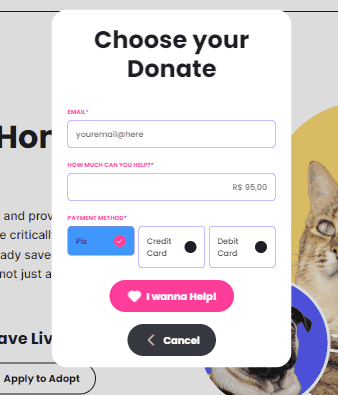
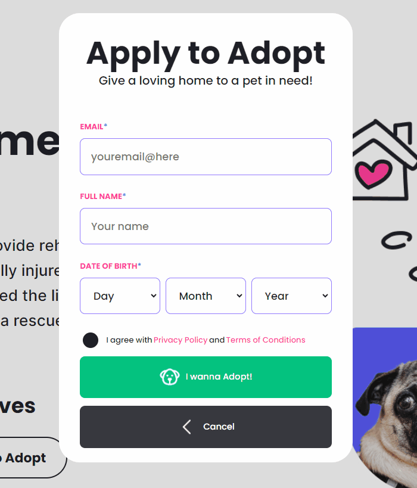

# Rescue Center

 
Compass UOL - FrontEnd Challenge: Rescue Center Project 

## Table of Contents

- [Challenge](#challenge)
- [Figma](#figma)
- [Screenshots](#screenshots)
- [Tools](#tools)
- [Author](#author)

## Challenge

This project is a challenge from Compass UOL for the interns to complete and learn experiences. 
To accomplish this task, the only technologies allowed to use were HTML, CSS and JavaScript, being banned to use any framework or libraries to create the application.

## Figma

The challenge was based accordingly to the design and user interface in [Figma](https://abrupt-sword-b4e.notion.site/Desafio-Semana-4-AWS_FRONTEND_MAI24-ad336ce3d399478aab126561a92fe3a9)

## Screenshots

### Desktop Screen

### Donation Modal

### Adoption Modal

## Tools

- HTML with semantic elements
- Style with CSS
- JavaScript (DOM and functions)

## Author

- LinkedIn - [Camila Katayama](https://www.linkedin.com/in/camila-katayama-ab1a42153/)
- GitHub - [@camilakataa](https://github.com/camilakataa)

